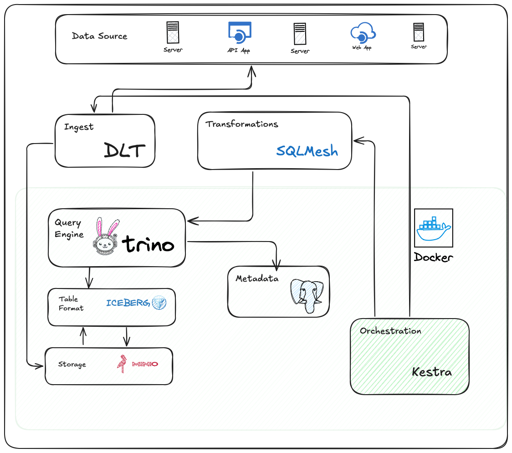

# Trino with Iceberg, Postgres, and MinIO

This is an example using Trino with an Iceberg connector, a Postgres metastore, and MinIO for object storage.

## What You Will Learn

- **Apache Iceberg**: Understand how to work with Iceberg tables for managing large datasets in data lakes with schema evolution and time travel.
- **Kestra**: Master workflow orchestration and scheduling for complex ETL/ELT pipelines.
- **Trino**: Query your data from multiple sources (MinIO, PostgreSQL, Iceberg) with a fast federated SQL engine.
- **Metabse**: Create interactive dashboards and visualizations to analyze and present your data.
- **SQLMesh**: Transformation framework for SQL
- **MinIO**: Learn about object storage and how it integrates with modern data pipelines, serving as your S3-compatible storage layer. (Using this architecture for a NYC 
- **PostgreSQL**: Use a relational database for metadata management and storing structured data.

<p align='center'>
  

## Services

### MinIO (Object Storage)
- **Purpose**: Acts as an S3-compatible object storage layer for raw and processed data.
- **What You’ll Learn**:
  - Uploading and managing files via the MinIO Console.
  - Using MinIO as a source and destination for ETL pipelines.
- **Console URL**: [http://localhost:9001](http://localhost:9001)

### PostgreSQL
- **Purpose**: A relational database for storing metadata, structured data, and managing transactions.
- **What You’ll Learn**:
  - Querying relational datasets using SQL.
  - Storing and retrieving structured data for analysis or visualization.

### Trino
- **Purpose**: A federated query engine for SQL-based exploration of multiple data sources.
- **What You’ll Learn**:
  - Querying data stored in MinIO, PostgreSQL, and Iceberg tables.
  - Using SQL to join data from different sources.
- **Web Interface URL**: [http://localhost:8080](http://localhost:8080)


## How to Run

1. **Clone the Repository**  
   ```bash
   git clone git@github.com:vndv/de_zoomcamp_2025.git
   cd de_zoomcamp_2025/md-stack
   ```

2. **Build & Start Services**
    ``` bash
      docker-compose up -d
    ```

3. **Python Environment**
   ```python
   python3.9 -m venv .venv
   source .venv/bin/activate
   pip install -r requirements.txt
   ```

4. **Access Servies**
 - MinIO Console: http://localhost:9001 (user: minio-user, password: minio-password)
 - PostgreSQL: localhost:5432 (user: postgres-user, password: postgres-password, database: iceberg)
 - Trino: http://localhost:8080 (user: admin)


5. **Work with Trino**
 - Add secret key from minio to .dlt/secrets.toml
 - Run ```python3 chess_pipeline.py```
 - Create tables from example.sql


Stop and remove the containers and network:
```shell
docker-compose down
```
